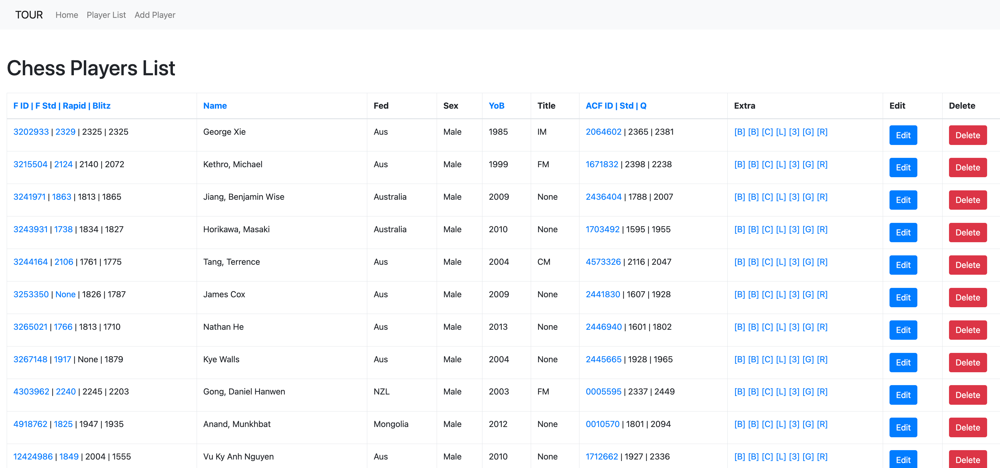
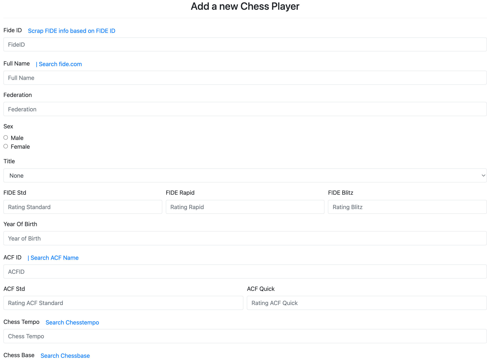

# What is this 

This tool help you gather data for chess players in a single place.
This help you prepare for tournaments, researching about your potential opponents. 

# How to run 

```bash 
$python3 -m venv .myenv
$. .myenv/bin/activate
(.myenv)$pip install -r requirements.txt 
$python app.py
``` 

open `http://localhost:5430/`

# Tournament Prep in Action 

## Player list 


## Add a new player 


# Note on https://github.com/xRuiAlves/fide-ratings-scraper

Installation: `npm i -g fide-ratings-scraper`
Get player info: `fide-ratings-scraper get <FideID>`